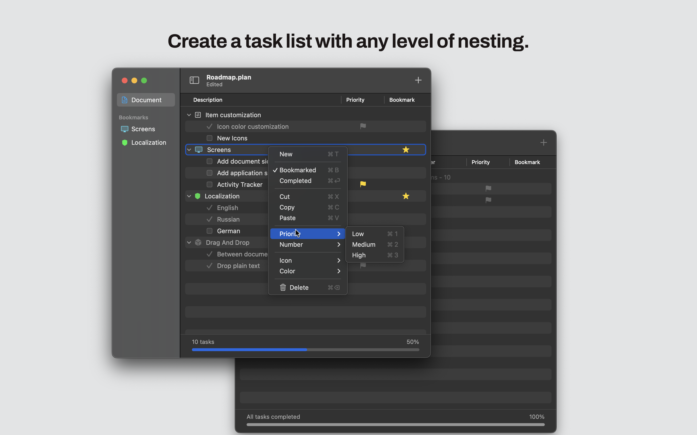

## About

Introducing the structural nested list editor for macOS

## Features

* Creating and editing nested lists of any complexity.
* Ability to customize the style and formatting of lists.
* Drag&Drop support.
* Hotkeys support.

## Releases

- [v1.3](https://github.com/unsaferawpointer/Plan/releases/tag/v1.3.0)

## Roadmap

- Item customization
	* Icon color customization
- Add flat tasks list with sorting
- Add document sidebar
- Add application settings
- Localization
	* Ukrainian
	* Spanish
	* German

## Localization

- English
- Russian

## Privacy Policy

Your docs (which you create and write inside Plan) are saved locally on your device as plain text-files and synchronized using across your devices using iCloud Drive (by Apple). Your data is not stored on our servers, not sent to any third-party service by us (other than mentioned Apple). The information is not sent outside of the app. The data is, however, saved on Apple's servers being an Apple technology, which might be in the U.S. If you don't want your data to be saved on Apple's server, disable iCloud (synchronization won't work). Disable 'iCloud Drive' as well, if you don't want your docs to be synchronized by Apple's servers. Read here more about how Apple is handling your data: https://support.apple.com/HT202303.

Our Privacy Policy may change from time to time. If you have any questions or suggestions regarding our Privacy Policy, please contact us at zeroindex@icloud.com

## Contact us
- email: zeroindex@icloud.com
